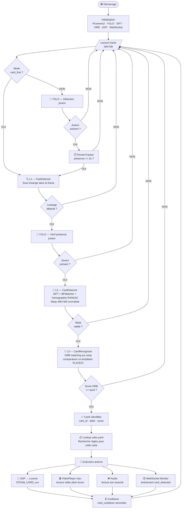
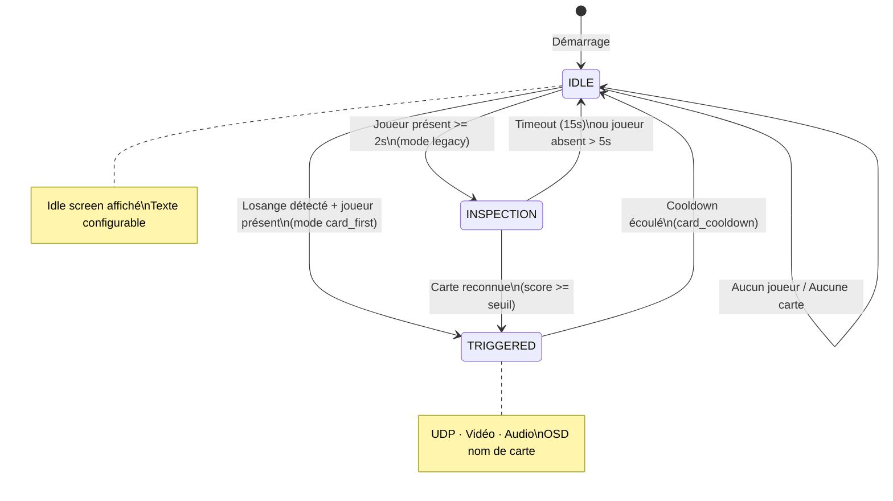
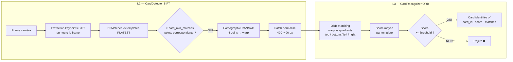
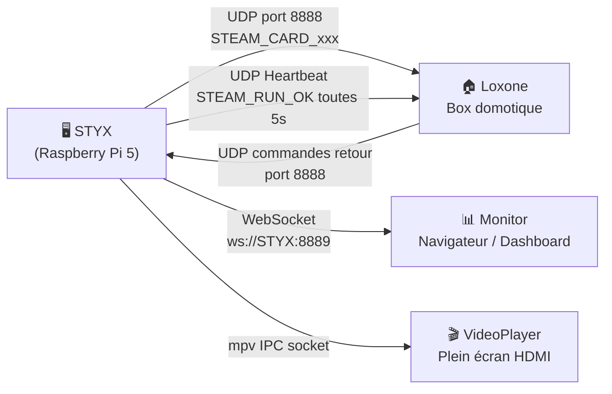
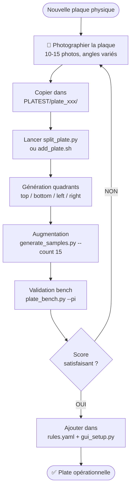

# Algorigramme — S.T.E.A.M Vision

Fonctionnement complet du système, de l'acquisition caméra au déclenchement des effets.

---

## Pipeline principale

---

## Machine à états

---

## Détail détection carte (L2 → L3)

---

## Communication réseau

---

## Ajout d'une nouvelle plate

